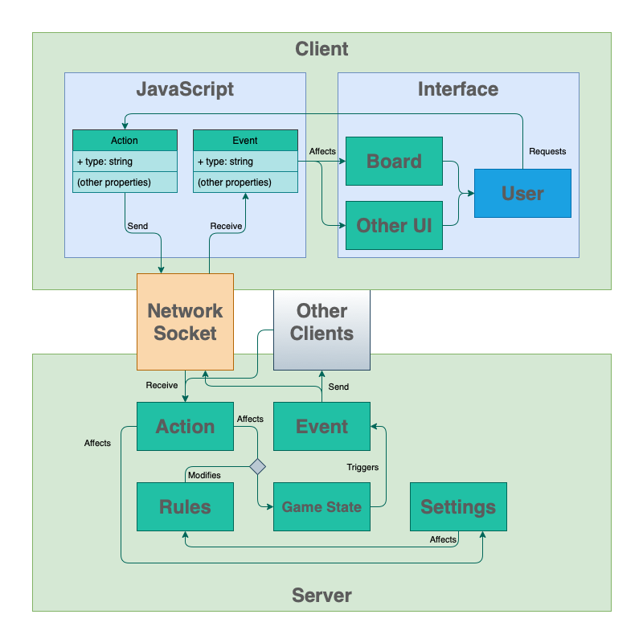

# Super Rummy Architecture

A **client-server** architecture is used for Super Rummy.

In this architecture, a central server manages games and rules. The client presents the current state of the game to the user, and allows users to perform "actions" that can advance the game. In response to these actions, the server will send back "events" notifying all clients of the changes resulting from player actions.

This architecture is inevitable, since a central server is required to coordinate gameplay between differnet players across multiple devices; and this needs to be done in an isolated manner, where rules can be enforced without relying on the trust of a client.
